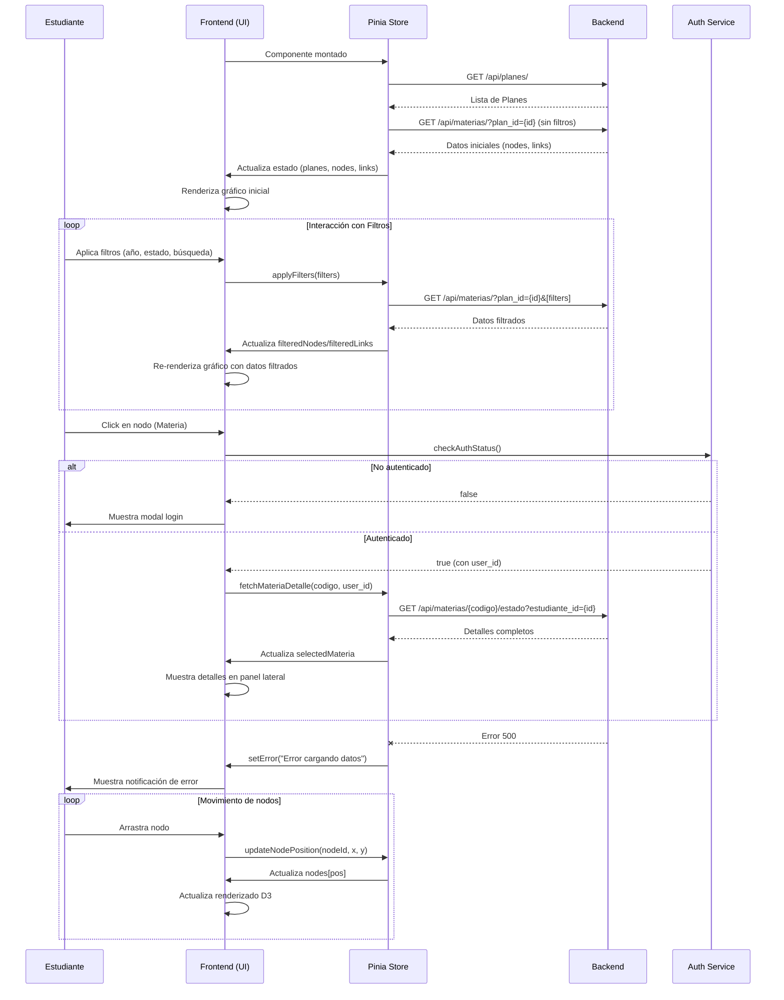
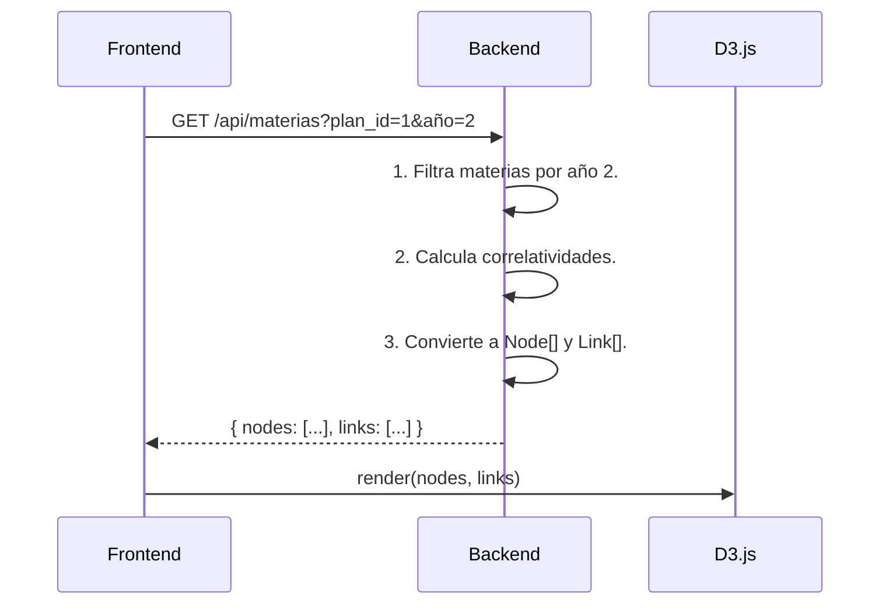
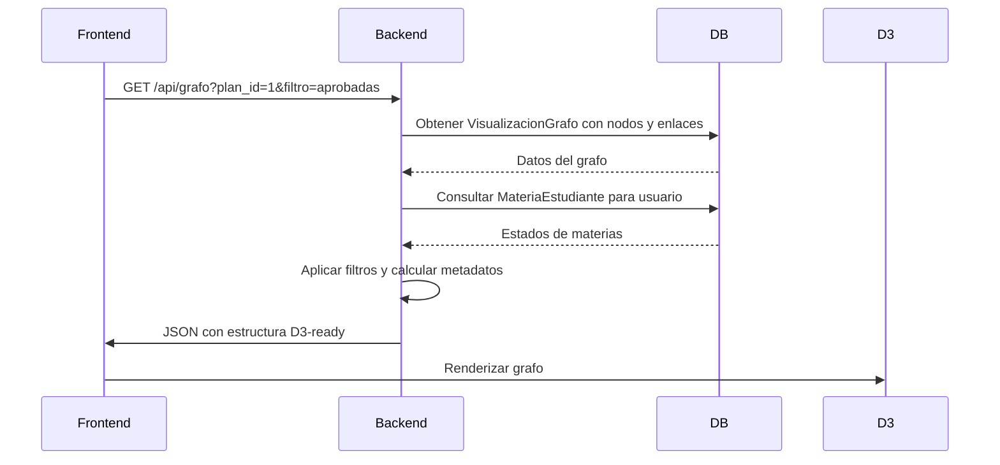
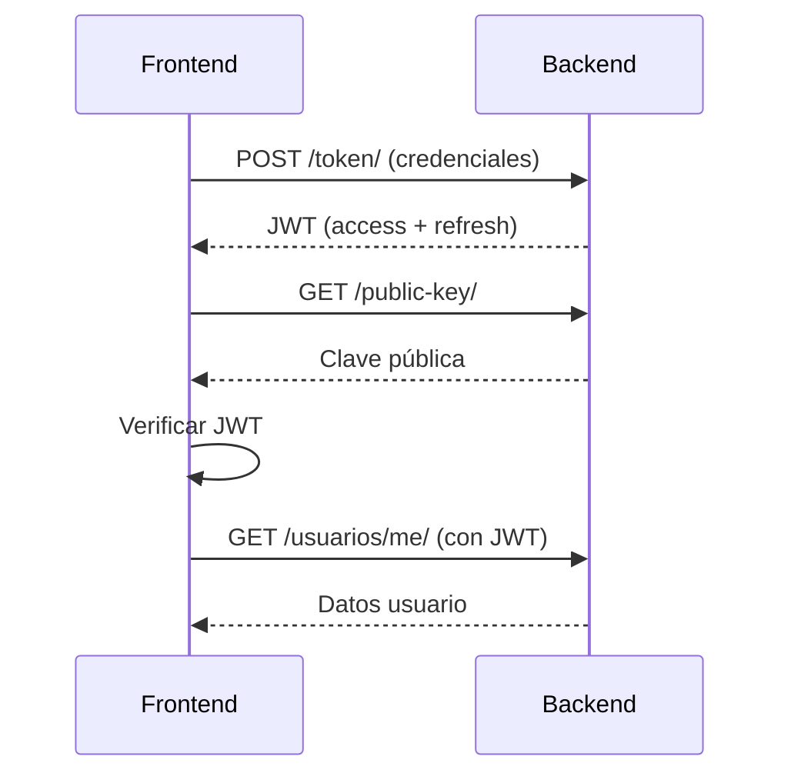
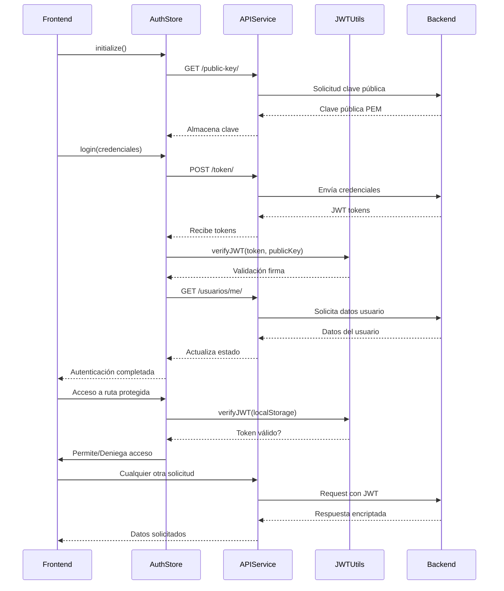
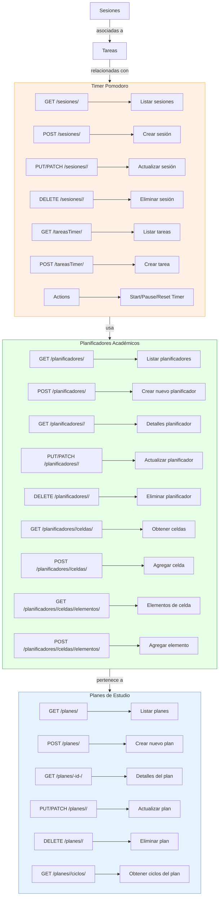
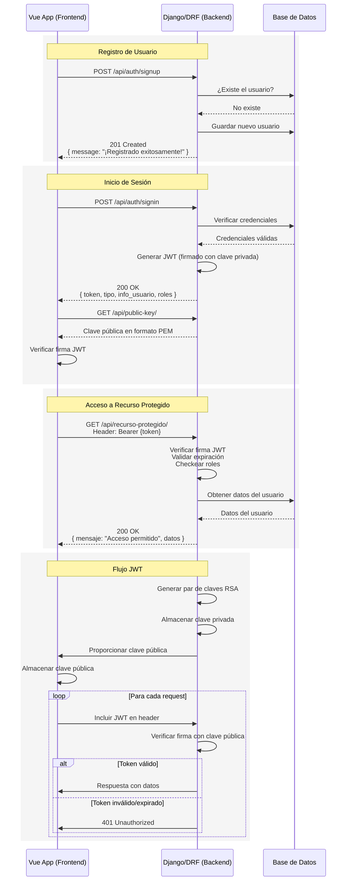

# StudyCompass (?)

Este proyecto se compone de diferentes secciones: backend, frontend, mobile y deployment. El backend está desarrollado en Django y gestiona los modelos PlanDeEstudio y Materia. En este modelo, se utiliza una relación ManyToMany para manejar las correlativas entre las materias, lo que permite definir de manera flexible las asignaturas que son requisitos para cursar otras. Los datos de las materias se gestionan a través de estos modelos y se procesan dentro de la base de datos.

El frontend está basado en Vue.js con Vite. Utiliza componentes como App.vue y main.ts para estructurar la interfaz de usuario, mientras que TypeScript ayuda a proporcionar un tipado estático, lo cual mejora la calidad y mantenibilidad del código. Este enfoque permite una integración fluida entre los componentes de la aplicación, facilitando su escalabilidad y desarrollo.

La parte mobile está desarrollada con Flutter. En este caso, los archivos esenciales son main.dart y pubspec.yml, que permiten configurar la aplicación móvil y gestionar las dependencias necesarias para su funcionamiento. Flutter proporciona la capacidad de crear aplicaciones multiplataforma, lo que permite que el proyecto sea accesible tanto en dispositivos móviles Android como iOS.

En el deployment, se incluyen los archivos necesarios para configurar y desplegar la aplicación. Cada componente del proyecto (backend, frontend y mobile) tiene su propio Dockerfile para crear contenedores específicos para cada uno. Con el archivo docker-compose.yml se orquesta la ejecución de estos contenedores de manera conjunta, facilitando la gestión de los diferentes servicios. Además, se utiliza Nginx como servidor web para manejar las solicitudes HTTP, redirigiendo el tráfico a los contenedores correspondientes. Todo el sistema se puede levantar fácilmente con el comando docker-compose up, lo que permite iniciar y administrar el entorno de desarrollo o producción sin complicaciones.

.
├── backend
│   ├── core
│   │   ├── asgi.py
│   │   ├── __init__.py
│   │   ├── settings.py
│   │   ├── urls.py
│   │   └── wsgi.py
│   ├── dbwait.py
│   ├── init.py
│   ├── manage.py
│   ├── plan_de_estudio
│   │   ├── admin.py
│   │   ├── apps.py
│   │   ├── filters.py
│   │   ├── __init__.py
│   │   ├── materias.xlsx
│   │   ├── migrations
│   │   │   ├── 0001_initial.py
│   │   │   ├── __init__.py
│   │   ├── models.py
│   │   ├── serializers.py
│   │   ├── tests.py
│   │   ├── tools.py
│   │   ├── urls.py
│   │   └── views.py
├── delete_pycache.sh
├── deployment
│   ├── backend.Dockerfile
│   ├── docker-compose.yml
│   ├── frontend.Dockerfile
│   ├── init.sh
│   ├── mobile.Dockerfile
│   ├── nginx.dockerfile
│   └── requirements.txt
├── frontend
│   ├── index.html
│   ├── package.json
│   ├── package-lock.json
│   ├── public
│   │   └── vite.svg
│   ├── README.md
│   ├── src
│   │   ├── App.vue
│   │   ├── assets
│   │   │   └── vue.svg
│   │   ├── components
│   │   │   └── HelloWorld.vue
│   │   ├── main.ts
│   │   ├── style.css
│   │   └── vite-env.d.ts
│   ├── tsconfig.app.json
│   ├── tsconfig.json
│   ├── tsconfig.node.json
│   ├── vite.config.js
│   └── vite.config.ts
├── mobile
│   ├── assets
│   ├── lib
│   │   └── main.dart
│   ├── pubspec.yml
│   ├── requirements.txt
│   └── web
│       └── index.html
├── readme.MD
└── show_dirs.sh

# TO-DO

## FRONTEND
- [ ] En un planificador debe ser posible **mover** los elementos lugar entre ellos.

## BACKEND
- [ ] AUTENTICACION
- [ ] SEGURIZACIÓN DE ENDPOINTS

## MOBILE
- [ ] CONECTAR CON BACKEND
- [ ] AGREGAR FUNCIONALIDADES
- [ ] (CELU) Herramienta de Control de Gastos: Herramienta para registrar gastos académicos (materiales, transporte, etc.) y sugerir formas de ahorrar.

## PLANES DE ESTUDIO
- [ ] Personalización de colores del grafo.
- [ ] Filtrar por materias disponibles (logica de disponibilidad: cantidad de creditos y correlativas aprobadas)
- [ ] Visualización diferenciada para materias aprobadas (se deben ver el nombre tachado, el color gris y sus conexiones de gris tmb )
- [ ] Visualizacion de un apartado promedio de carrera: Se mostrará la cantidad de créditos que el usuario tiene, el porcentaje de la carrera completado (real y si fuese el simulado) y otros datos relevantes, como promedios.
- [ ] "Calificaciones" y progreso (Se permitirá al usuario marcar materias como "aprobadas" para simular el cálculo de créditos y porcentaje en la carrera, sin que esto implique cambiar su estado en el backend).
- [ ] Visualizacion de nivel de dificultad diferenciada (tipo un termometro?)
- [ ] Promedio de finalización de carrera, cuando te recibís te felicita y cambia de colores
- [ ] Permite filtrar por un conjunto de materias seleccionadas (por ejemplo para ver las que está cursando en el cuatrimestre)
- [ ] Combinaciones más comunes (Podría mostrar las combinaciones de materias que los estudiantes suelen cursar por ejemplo juntas o separadas por nivel de dificultad, también por cantidad, etc),

- [X] Nivel de dificultad
- [X] "Detalle de materia" (Al hacer clic en un nodo, se abrirá un modal (dialog móvil) con la información detallada de la materia para el usuario.)
- [X] Filtro de materias por sus campos (nombre, año, etc)
- [X] LAS MATERIAS OPTATIVAS DEBEN INICIAR "OCULTAS"

---
- [ ] **MODO EDICION DE LOS PLANES DE ESTUDIO**: DEBE HABER UNA FORMA DE EDITAR/ELIMINAR Y CREAR (CONECTAR,ETC) MATERIAS Y PLANES DE ESTUDIO.
- [ ] Exportar plan (captura y de ser posible como csv/json)
- [ ] Importar plan

## CARRERA
- [ ] DASHBOARD CON ESTADISTICAS DE LA CARRERA, ETC
- [ ] RENDIMIENTO DE LA CURSADA, ETC
- [ ] Pomodoro reporte por semana etc
- [ ] MOSTRAR CUANDO SE ESTUDO MÁS ACTIVO Y EN QUÉ COSAS (COMO EN GITHUB)
- [ ] CALIDAD DE ESTUDIO, PROGRESO, QUE HICE TAL SEMANA
- [ ] SECCION POR CALENDARIO ACADEMICO PARA **ARMAR** LAS MATERIAS DE TU CUATRI
- [ ] ORGANIZACION POR CUATRIMESTRE: permitir visualizar las materias, horarios, eventos y tareas de cada cuatrimestre
- [ ] Dashboard para una materia y para más de una a la vez

## TIMER
- [X] Poder des-seleccionar una tarea.
- [ ] Las sesiones deben decir cuando duran, en el dialog.
- [X] Agregar más estilos.
- [ ] Al completar una Actividad es necesario una notificación.
- [X] Al completar una Sesión cambiar de color a verde.
- [X] Al completar una Tarea, una notificación.

## PLANIFICADORES
- [ ] PREVISUALIZAR CON [Html Canvas](https://html2canvas.hertzen.com/)
- [ ] Creación de plantillas (calendario, Por tareas, etc)
- [ ] Exportar planificadores a PDF
- [ ]

## AGREGAR SISTEMA DE NOTAS
- [ ] UTILIZAR LOS PLANIFICADORES COMO EJEMPLO PARA AGARRAR Y SOLTAR

## PERFIL DEL USUARIO
- [ ] Logros Académicos: Sistema de medallas o insignias por objetivos cumplidos, como aprobar todas las materias de un cuatrimestre o participar en actividades extracurriculares.
- [ ] Ranking Colaborativo: Tablas que destaquen a los estudiantes más activos en foros, grupos de estudio o participación en eventos.
- [ ] Marcar que estudias y laburas

## SISTEMA DE NOTIFICACIONES
- [ ] IMPLEMENTAR
- [ ] Modelo cursada notificación por horario de inscripción en el celu y mail: Notificaciones push y por correo electrónico sobre fechas de inscripción, inicio de clases, etc., serían de gran ayuda.

---

## DASHBOARD FACULTATIVO
- [ ] Dónde estudiar (MAPA): MAPITA CON BIBLIOTECAS VIRTUALES SEGÚN TU FACULTAD Y ALGUNOS LUGARES "IMPERDIBLES".
- [ ] ORIENTAR AL ESTUDIANTE DONDE ESTUDIAR Y POR QUÉ
- [ ] Mentoría Inversa: Espacio para que estudiantes compartan habilidades digitales o conocimientos recientes con profesores o profesionales mayores.
- [ ] Sistema de Feedback Directo a la Universidad, ESTUDIANTES MANDEN DATA A LAS FACULTADES, SUGERENCIAS, ETC.
- [ ] Apuntes y Resúmenes: Una plataforma donde los estudiantes puedan compartir, comprar, vender, resúmenes y material de estudio (con verificación de calidad y reseñas).
- [ ] Sección de noticias y novedades

## DASHBOARD POST FACULTAD
- [ ] Herramienta para explorar caminos profesionales según la carrera, combinando datos sobre empleabilidad, roles comunes y salarios promedio.

## DASHBOARD Comunidad y Colaboración:
- [ ] Marcar horarios de materias de distintos usuarios.
- [ ] Compartir entre usuarios: Permitir compartir apuntes, resúmenes, recursos y experiencias sería muy valioso.
- [ ] Sesiones compartidas
- [ ] Grupos de estudio virtuales: Plataforma para crear y unirse a grupos de estudio virtuales, con herramientas como chat, pizarra compartida y videoconferencia.
---
- [ ] Cómo conectar entre estudiantes de distintas carreras. Podría basarse en intereses comunes, materias optativas o proyectos interdisciplinarios.
- [ ] Foros de Discusión por Materia: Espacios para debates, preguntas y respuestas sobre temas específicos de cada materia, moderados por estudiantes avanzados o profesores.
- [ ] Centro de estudiantes cuenta diferenciada para obtener más gente: Dar visibilidad a las actividades y permitirles publicar información relevante para los estudiantes.
- [ ] Recompensas por Participación: Un sistema de puntos canjeables por beneficios académicos (como extensiones de biblioteca, asesorías gratuitas o acceso a material premium) para incentivar el uso de la plataforma.
- [ ] Eventos de carrera (PARA PENSAR): Un calendario de eventos académicos, charlas, talleres, etc.

## TESISTAS
- [ ] GESTOR DE BIBLIOGRAFÍA
- [ ] TUTORES, DEBATES, ETC
- [ ] TEMAS , ESTADO DE LA CUESTION
- [ ] RECOLECTOR DE INFORMACIÓN (LINKS, FOTOS, ETC)

## SISTEMA DE RECOMENDACIONS
- [ ] Podría recomendar materias optativas, cursos complementarios, LABORATORIOS, ACTIVIDADES DEL CENTRO, o incluso grupos de estudio basándose en el perfil del estudiante. || Proyectos a los que te podes sumar / Laboratorios
- [ ] Rating de catedras, nivel de dificultad
- [ ] Networking con Empresas: Una sección que facilite el contacto con empresas para pasantías, prácticas profesionales y ofertas de empleo, con la posibilidad de organizar ferias de empleo virtuales. || Ofrecer trabajo part time pero llenando donde y qué haces
- [ ] Bolsa de trabajo o similar

## ESTADISTICAS
- [ ] ENCUESTA POST CURSADA
- [ ] Pomodoro reporte por semana etc
- [ ] Marcar promedios de la carrera ranking de estudiantes.

## INTEGRACION
- [ ] Sincronización con Apps Externas: Vinculación con Google Calendar, Notion o Trello para integrar el calendario académico con herramientas personales de gestión.
- [ ] Gestión de Documentos: Un repositorio personal en la nube para guardar apuntes, trabajos prácticos y exámenes pasados organizados por materia.

## GRAFICO DEL SISTEMA

## FLUJO DE FILTRADO DE GRAFOS

## GRAFICO DE AUTENTICACION

## FLUJO DE INTERACCION DE AUTENTICACION

## ENDPOINTS

## AUTENTICACION
